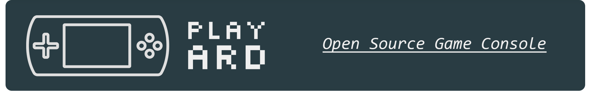
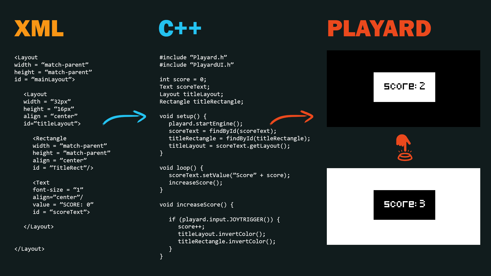
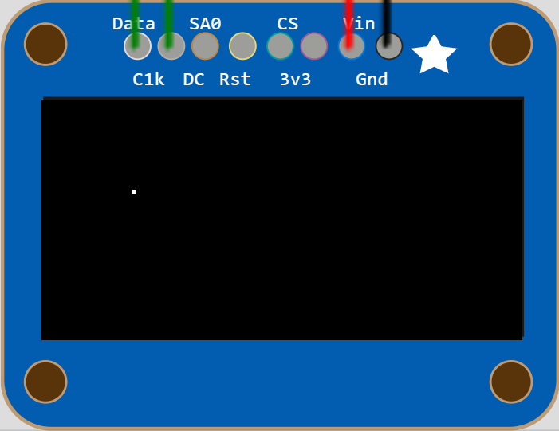
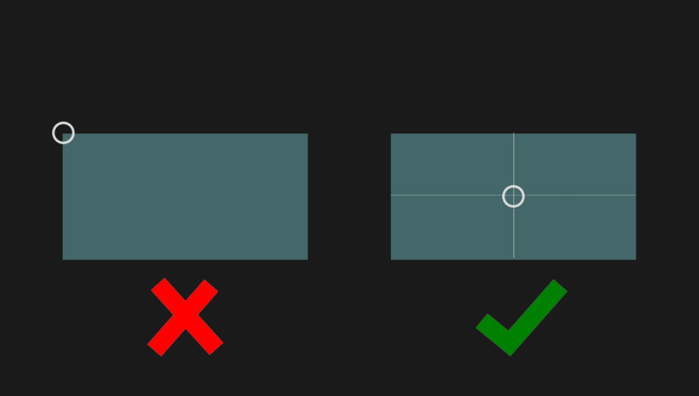

# What is Playard?

It is an open-source educational project that aims to impose today's technologies on people in a fun way and they can be involved in the development of the project.


# What Have We Done So Far ?
We wanted to develop the idea of ​​a retro game console made abroad using a microcontroller. We started working on it. We set our microcontroller as **ESP32**. We worked on the coding. We also stored and shared the codes we wrote on GitHub. With new research and brainstorming, we reached a solution for every problem that came our way. We wanted to develop our project in line with the events we participated in and the information we gained, and we brought up our idea of ​​IoT (Internet of Things). Our game console can connect to the wireless network and we get the data used in the game over the internet, eliminating the memory problem. Another innovation that we do not have in other projects is that we have created a design window on our website where we can easily design a game. All our users will be able to design the images of their own games using this system.

# What are our tools and goals ?
The concept of our product is for first-hand testing of software technologies and applications. Our vehicles; are the electronic, software parts and systems we use. At the same time, each of our users who use our project becomes a supporter for the development of the project. It is our goal to convey the algorithm logic and game design fundamentals to our users and to improve their programming skills.

# Why Use Playard Game Engine?

Playard Game Engine is created based on idea for seperating graphic design and programming processes for provide a more abstract programming experience. With its built-in XML based graphic engine it is more easier to work on graphics. Thus, it reduces development and test durations and increases the productivity.



# How to Create Your Own Game

The Playard Game Engine is a game engine based on the speed of the C++ language and the flexibility of the XML language. It allows you to make impressive games by shortening the development process. To make great games with the Playard Game Engine, you just need to download the source codes and include them in your program.

## What Are Components and How to Use Them

Components is one of the innovative solutions of the Playard Game Engine. On PGE, everything is produced and arranged in the form of components.Different components created for figures, texts and images are arranged in the background and displayed on the screen. Components thus provide a cleaner working environment for the programmer.

To use the components in our program we must load a XML string in PGE.
```cpp
```

### Layouts

Layouts are components that can contain component types, including layouts. Components can be grouped with layouts so that items on the screen can be aligned relative to each other or moved together. Each component has a parent layout, and the position of each component must be specified relative to the position of its parent. A layout has some attributes like "x-position", "y-position", "visibility" etc.

We can create a layout component in XML. It must has an ID.

```xml
<Main>
  <Layout
  id = 'mainLayout'
  x-position = '128'
  y-position = '64'>

  </Layout>
</Main>
```

We must convert our XML document to C++ string. And now we can access it in our program with defined id.
```cpp
const char* main_xml =
"<Main>"
"  <Layout"
"  id = 'mainLayout'"
"  x-position = '128'"
"  y-position = '64'>"
""
"  </Layout>"
"</Main>"
""
;

gfxEngine.loadXML(main_xml);
Layout* mainLayout = gfxEngine.findLayoutByID("mainLayout");
```

If we want to move our mainLayout up by 5 pixels, all we have to do change its vertical position.

```cpp
mainLayout->setY(mainLayout->getY() - 5);
```

### Points

Points are components that are represents the pixels on the screen.

To create a point all we need to do create a point tag and define an ID for it, in our mainLayout.

**Example Usage**
```xml
<Main>
  <Layout
    id = 'mainLayout'
    x-position = '128'
    y-position = '64'>
    <Point id = 'point1' x-position='24' y-position='24'/>
  </Layout>
</Main>
  ```


```cpp
const char* main_xml =
"<Main>"
"  <Layout"
"  id = 'mainLayout'"
"  x-position = '128'"
"  y-position = '64'>"
"    <Point id = 'point1' x-position='24' y-position='24'/>"
"  </Layout>"
"</Main>"
;

gfxEngine.loadXML(main_xml);
Point* point = gfxEngine.findPointByID("point1");
```



For an example, if we want to hide our new point component we need set its visibility to 0.

```cpp
point->setVisibility(0);
```

### Rectangles

Rectangles are components for displaying rectangles on the screen. They have arguments named "x-position", "y-position", "border-radius" etc.

To display a rectangle on the screen, we need to create a rectangle tag in a layout.

```xml
<Main>
  <Layout
    id = 'mainLayout'
    x-position = '128'
    y-position = '64'>
    <Rectangle id = 'rect' x-position='64' y-position='32' width='42' height='24' border-radius='4'/>
  </Layout>
</Main>
```

**Example Usage**

```cpp
code example
```

### Circles

Lorem ipsum dolor sit amet, consectetur adipiscing elit. Phasellus id ante iaculis, pretium lectus in, maximus lectus. In eros erat, tincidunt et varius sit amet, tristique et dui.

**Example Usage**

```cpp
code example
```

### Triangles

Lorem ipsum dolor sit amet, consectetur adipiscing elit. Phasellus id ante iaculis, pretium lectus in, maximus lectus. In eros erat, tincidunt et varius sit amet, tristique et dui.

**Example Usage**

```cpp
code example
```

### Texts

Lorem ipsum dolor sit amet, consectetur adipiscing elit. Phasellus id ante iaculis, pretium lectus in, maximus lectus. In eros erat, tincidunt et varius sit amet, tristique et dui.

**Example Usage**

```cpp
code example
```

## How Alignment Works

Amet, tristique et dui. Lorem ipsum dolor sit amet, consectetur adipiscing elit. Phasellus id ante iaculis, pretium lectus in, maximus lectus. In eros erat, tincidunt et varius sit amet, tristique et dui. Lorem ipsum dolor sit amet, consectetur adipiscing elit. Phasellus id ante iaculis, pretium lectus in, maximus lectus. In eros erat, tincidunt et varius sit amet, tristique et dui.



## How to Interact with Player

### Buttons

Lorem ipsum dolor sit amet, consectetur adipiscing elit. Phasellus id ante iaculis, pretium lectus in, maximus lectus. In eros erat, tincidunt et varius sit amet, tristique et dui.


```cpp
code example
```

### Gyroscope

Lorem ipsum dolor sit amet, consectetur adipiscing elit. Phasellus id ante iaculis, pretium lectus in, maximus lectus. In eros erat, tincidunt et varius sit amet, tristique et dui.


```cpp
code example
```

### Built-in Keyboard Module

Lorem ipsum dolor sit amet, consectetur adipiscing elit. Phasellus id ante iaculis, pretium lectus in, maximus lectus. In eros erat, tincidunt et varius sit amet, tristique et dui.


```cpp

```

# Game Gallery

<div >


</div>

# Used Libraries

- Graphic library : https://github.com/adafruit/Adafruit-GFX-Library

- Serial Peripheral Interface : https://github.com/arduino/ArduinoCore-avr/blob/master/libraries/SPI/src/SPI.h

- Inter-Integrated Circuit : https://github.com/rambo/I2C

- Display Library : https://www.arduino.cc/reference/en/libraries/adafruit-ssd1306/

- Pugi-XML : https://pugixml.org/

# Special Thanks

- Lorem ipsum dolor sit amet, consectetur adipisicing elit, sed do eiusmod tempor incididunt ut labore et dolore magna aliqua. Ut enim ad minim veniam, quis nostrud exercitation ullamco laboris nisi ut aliquip ex ea commodo consequat. Duis aute irure dolor in reprehenderit in voluptate velit esse cillum dolore eu fugiat nulla pariatur. Excepteur sint occaecat cupidatat non proident, sunt in culpa qui officia deserunt mollit anim id est laborum.

- Lorem ipsum dolor sit amet, consectetur adipisicing elit, sed do eiusmod tempor incididunt ut labore et dolore magna aliqua. Ut enim ad minim veniam, quis nostrud exercitation ullamco laboris nisi ut aliquip ex ea commodo consequat. Duis aute irure dolor in reprehenderit in voluptate velit esse cillum dolore eu fugiat nulla pariatur. Excepteur sint occaecat cupidatat non proident, sunt in culpa qui officia deserunt mollit anim id est laborum.

- Lorem ipsum dolor sit amet, consectetur adipisicing elit, sed do eiusmod tempor incididunt ut labore et dolore magna aliqua. Ut enim ad minim veniam, quis nostrud exercitation ullamco laboris nisi ut aliquip ex ea commodo consequat. Duis aute irure dolor in reprehenderit in voluptate velit esse cillum dolore eu fugiat nulla pariatur. Excepteur sint occaecat cupidatat non proident, sunt in culpa qui officia deserunt mollit anim id est laborum.


**© 2021-2022 Playard Inc.**
