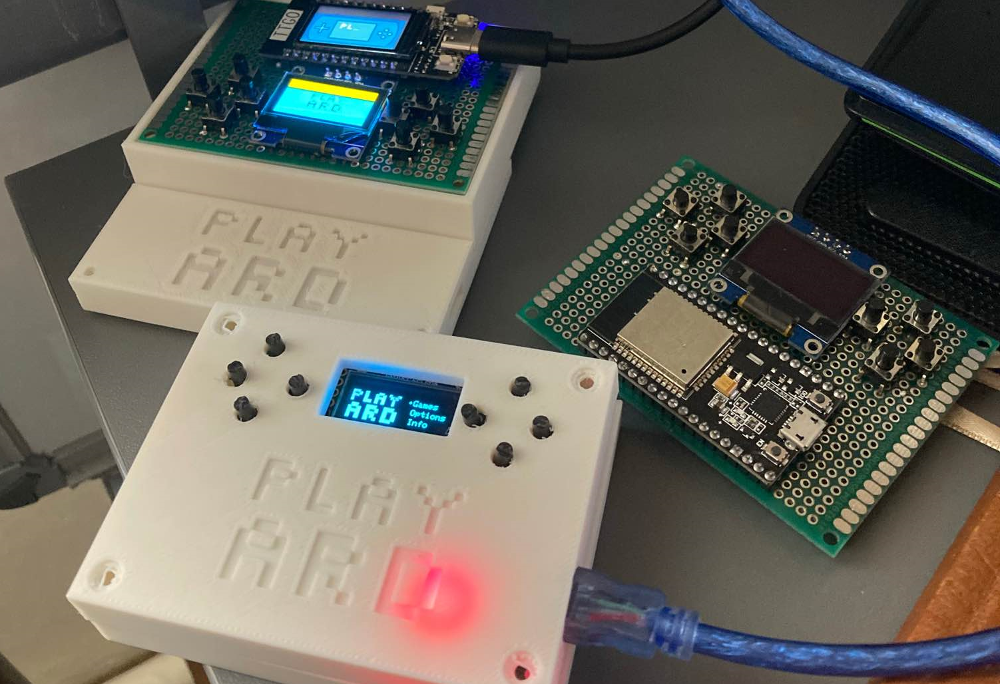
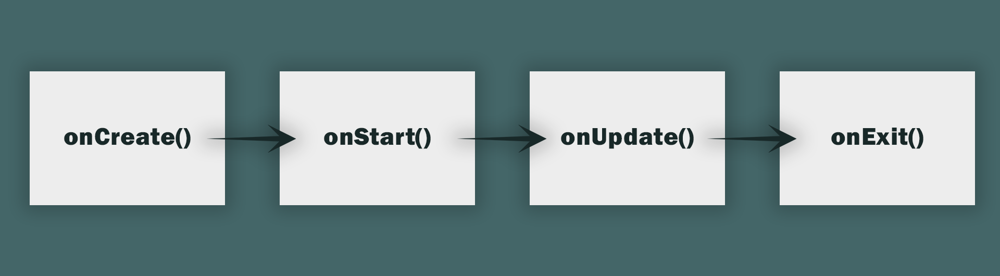
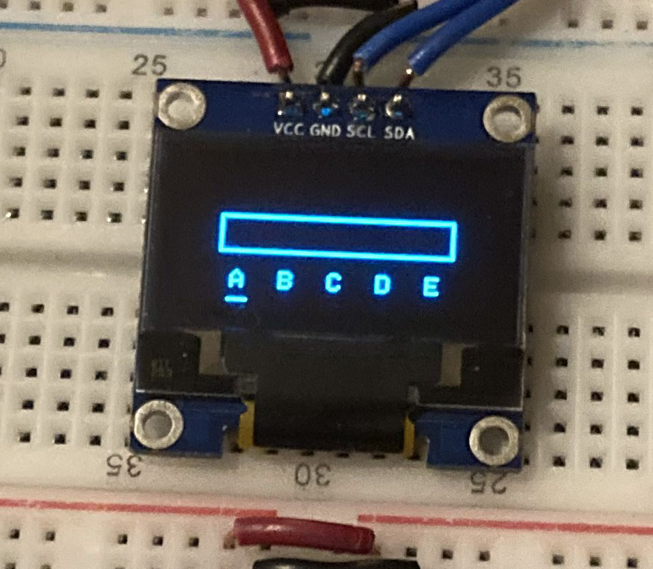

# What is Playard?

It is an open-source educational project that aims to impose today's technologies on people in a fun way and they can be involved in the development of the project.



# What Have We Done So Far ?
We wanted to develop the idea of ​​a retro game console made abroad using a microcontroller. We started working on it. We set our microcontroller as **ESP32**. We worked on the coding. We also stored and shared the codes we wrote on GitHub. With new research and brainstorming, we reached a solution for every problem that came our way. We wanted to develop our project in line with the events we participated in and the information we gained, and we brought up our idea of ​​IoT (Internet of Things). Our game console can connect to the wireless network and we get the data used in the game over the internet, eliminating the memory problem. Another innovation that we do not have in other projects is that we have created a design window on our website where we can easily design a game. All our users will be able to design the images of their own games using this system.

# What are our tools and goals ?
The concept of our product is for first-hand testing of software technologies and applications. Our vehicles; are the electronic, software parts and systems we use. At the same time, each of our users who use our project becomes a supporter for the development of the project. It is our goal to convey the algorithm logic and game design fundamentals to our users and to improve their programming skills.

# Why Use Playard Game Engine?

Playard Game Engine is created based on idea for seperating graphic design and programming processes for provide a more abstract programming experience. With its built-in XML based graphic engine it is more easier to work on graphics. Thus, it reduces development and test durations and increases the productivity.


# How to Create Your Own Game

The Playard Game Engine is a game engine based on the speed of the C++ and the flexibility of the XML. It allows you to make impressive games by shortening the development process. To make great games with the Playard Game Engine, you just need to download the source codes and include them in your program.

## Workspace Setup


### Downloading Playard Game Engine

#### Via Github Version Control System (VCS)

```shell
git clone https://github.com/play-Ard/playard.git
```

#### Via Code Button
You can also download it as a .zip file by clicking the Code > Download ZIP button above.

#### Via Download Link
[Download Here](https://github.com/play-Ard/playard/archive/refs/heads/main.zip)

### Project Structure

The default Playard project structure includes a games folder. All games accessible from the main menu must be created in this folder.

```
📦playard
  ┣ 📂core
  ┣ 📂modules
  ┣ 📂games
  ┃ ┗ 📜ExampleGame1.cpp
  ┃ ┗ 📜ExampleGame2.cpp
  ┃ ┗ 📜ExampleGame3.cpp
  ┗ 📜main.ino
```

In Playard Game Engine, it is recommended to write visual designs in XML and game codes in C++. Although Playard is Arduino based, games should be programmed with .cpp files instead of .ino files. In this way, a Playard device can keep multiple games in its memory. Don't worry if the files are .cpp files instead of .ino. In fact, Playard's core software does most of the preprocessing you do while programming Arduino. However, if you need, you can use all the functions you used while programming the Arduino.

### Game File Structure

In the Playard Game Engine, all games inherit from the Game class. A Playard game should contain the following elements:

1. Base XML design **_(required)_**
2. Logo to show in the main menu _(64 x 48 White Bitmap)_ **_(required)_**
3. A constructor that makes the necessary configurations **_(required)_**
4. onCreate method to specify what should happen before the screen loads
5. onStart method to specify what should happen when the game is just started **_(required)_**
6. onUpdate method to decide what happens while the game is running **_(required)_**
7. onExit method to run some commands like saving the current state of the game

Let's create an example game called MyGame.


```
📦playard
  ┣ 📂core
  ┣ 📂modules
  ┣ 📂games
  ┃ ┗ 📜MyGame.cpp
  ┗ 📜main.ino
```

```cpp
#include "../core/PlayardCore.h"

class MyGame : public Game
{
public:
    const unsigned char logo[384] PROGMEM = {}; /* LOGO AS BITMAP */
    const char *xml = "";                       /* XML DESIGN */

    GFXEngine *graphics;
    Input *input;

    MyGame(GFXEngine *_graphics, Input *_input) : Game(logo)
    {
        setXML(xml);
        this->graphics = _graphics;
        this->input = _input;
    }

    void onCreate() override
    {
        // Some codes to run before the screen loads
    }

    void onStart() override
    {
        // Codes to run as soon as the game starts
    }

    void onUpdate() override
    {
        // Codes that will work as long as the game continues
    }

    void onExit() override
    {
        // Codes that will work when the this->exit() method runs
    }
};
```


Let's take a look at our example game.
First we create a class called MyGame and this class should inherit from **Game** class. Then we define the logo of the game in bitmap format and the design template in xml format. Then you will learn how to convert your logo to bitmap format and your template to xml format.

A little below, we see that the graphics and input pointers are defined to reach the graphics and the inputs received from the user. We'll take a look at how to use them later.

Then, the necessary assignments are made in the constructor method.

Right after, we have onCreate, onStart, onUpdate, onExit methods. Every Playard game must override the onStart and onUpdate methods. We will look at the details of these methods later.

 

#### Designing a Screen with XML

Playard supports working with multiple designs with built-in XML processor. XML designs must specified as constant char pointer (const char *).

## What Are Components and How to Use Them

Everything is created and organized into components in the Playard Game Engine. Different types of components created for shapes, text, and images allow the programmer to work more effectively on designs. So the components provide a cleaner workspace.

### Layouts

Layouts are components that can contain component types, including layouts. Components can be grouped with layouts so that items on the screen can be aligned relative to each other or moved together. Each component has a parent layout, and the position of each component must be specified relative to the position of its parent. A layout has some attributes like "x-position", "y-position", "visibility" etc.

We can create a layout component in XML. It must has an ID.

```xml
<Main>
  <Layout
  id = 'mainLayout'
  x-position = '128'
  y-position = '64'>

  </Layout>
</Main>
```

 And now we can access our ball by call our getPointByID function with defined ID.

```cpp
const char* main_xml =
"<Main>"
"  <Layout"
"  id = 'mainLayout'"
"  x-position = '128'"
"  y-position = '64'>"
""
"  </Layout>"
"</Main>"
""
;

gfxEngine.loadXML(main_xml);
Layout* mainLayout = gfxEngine.findLayoutByID("mainLayout");
```

If we want to move our mainLayout up by 5 pixels, all we have to do change its vertical position.

```cpp
mainLayout->setY(mainLayout->getY() - 5);
```

### Points

Points are components that are represents the pixels on the screen.

To create a point all we need to do create a point tag and define an ID for it, in our mainLayout.

```xml
<Main>
  <Layout
    id = 'mainLayout'
    x-position = '128'
    y-position = '64'>
    <Point id = 'point1' x-position='24' y-position='24'/>
  </Layout>
</Main>
```

We can access our ball by call our getPointByID function with defined ID.

```cpp
const char* main_xml =
"<Main>"
"  <Layout"
"  id = 'mainLayout'"
"  x-position = '128'"
"  y-position = '64'>"
"    <Point id = 'point1' x-position='24' y-position='24'/>"
"  </Layout>"
"</Main>"
;

gfxEngine.loadXML(main_xml);
Point* point = gfxEngine.findPointByID("point1");
```


For an example, if we want to hide our new point component we need set its visibility to 0.

```cpp
point->setVisibility(0);
```

### Rectangles

Rectangles are components for displaying rectangles on the screen. They have arguments named "x-position", "y-position", "border-radius" etc.

To display a rectangle on the screen, we need to create a rectangle tag in a layout.

```xml
<Main>
  <Layout
    id = 'mainLayout'
    x-position = '128'
    y-position = '64'>
    <Rectangle id = 'rect' x-position='64' y-position='32' width='42' height='24' border-radius='4'/>
  </Layout>
</Main>
```

We can access our ball by call our getRectangleByID function with defined ID.

```cpp
const char* main_xml =
"<Main>"
"  <Layout"
"    id = 'mainLayout'"
"    x-position = '128'"
"    y-position = '64'>"
"    <Rectangle id = 'rect' x-position='64' y-position='32' width='42' height='24' border-radius='4'/>"
"  </Layout>"
"</Main>"
;

gfxEngine.loadXML(main_xml);
Rectangle* rectangle = gfxEngine.getRectangleByID("rect");
```

Let's move our rectangle left by 10 pixels.

```cpp
rectangle->setX(rectangle->getX() + 10);
```

### Circles

We can draw circles on the screen with Circle components. A circle component has some attributes named "fill", "visibility", "radius" etc.

We need to create a Circle tag in a layout first.

```xml
<Main>
  <Layout
    id = 'mainLayout'
    x-position = '128'
    y-position = '64'>
    <Rectangle id = 'rect' x-position='64' y-position='32' width='42' height='24' border-radius='4'/>
    <Circle id='ball' x-position='112' y-position='48' radius='2' fill='1'/>
  </Layout>
</Main>
```

We can access our ball by call our getCircleByID function with defined ID.

```cpp
const char* game_xml =
"<Main>"
"  <Layout"
"    id = 'mainLayout'"
"    x-position = '128'"
"    y-position = '64'>"
"    <Rectangle id = 'rect' x-position='64' y-position='32' width='42' height='24' border-radius='4'/>"
"    <Circle id='ball' x-position='112' y-position='48' radius='2' fill='1'/>"
"  </Layout>"
"</Main>"
;

gfxEngine.loadXML(game_xml);
Circle* ball = getCircleByID("ball");
```

Let's enlarge our ball 1 pixel. We can increase radius of ball.

```cpp
ball->setRadius(ball->getRadius() + 1);
```

### Triangles

We may want to create some arrow signs or hats in our game. At this point, triangle components come to our aid.

To draw a triangle on the screen, all we need to do is write a Triangle tag in our XML string.

```xml
<Main>
  <Layout
    id = 'mainLayout'
    x-position = '128'
    y-position = '64'>
    <Rectangle id = 'rect' x-position='64' y-position='32' width='42' height='24' border-radius='4'/>
    <Circle id='ball' x-position='112' y-position='48' radius='2' fill='1'/>
    <Triangle id='arrow' x1='12' y1='24' x2='12' y2='36' x3='24' y3='36'/>
  </Layout>
</Main>
```

We can access our arrow by call our getTriangleByID function with defined ID.

```cpp
const char* arrow_game_xml =
"<Main>"
"  <Layout"
"    id = 'mainLayout'"
"    x-position = '128'"
"    y-position = '64'>"
"    <Rectangle id = 'rect' x-position='64' y-position='32' width='42' height='24' border-radius='4'/>"
"    <Circle id='ball' x-position='112' y-position='48' radius='2' fill='1'/>"
"    <Triangle id='arrow1' x1='12' y1='24' x2='12' y2='36' x3='24' y3='36'/>"
"  </Layout>"
"</Main>"
;

gfxEngine.loadXML(arrow_game_xml);
Triangle* arrow = gfxEngine.getTriangleByID("arrow");
```

If we want to hide when the arrow hits an enemy all we need to set its visibility to 0.

```cpp
if (hit) {
  arrow->setVisibility(0);
}
```

### Texts

We learned draw so many shapes on our screen. But we don't always want to draw a shape. Also we may need to show score or name on the screen. At this point text components are very useful.

We can create a new text by write a Text tag in our XML in the same way.

```xml
<Main>
  <Layout
    id = 'mainLayout'
    x-position = '128'
    y-position = '64'>
    <Text id='score' x-position='8' y-position='8' value='0'/>
  </Layout>
</Main>
```

```cpp
const char* score_xml =
"<Main>"
"  <Layout"
"    id = 'mainLayout'"
"    x-position = '128'"
"    y-position = '64'>"
"    <Text id='scoreText' x-position='8' y-position='8' value='0'/>"
"  </Layout>"
"</Main>"
;

gfxEngine.loadXML(score_xml);
Text* scoreText = gfxEngine.getTextByID("scoreText")
```

Let's increase our score by 1.

```cpp
score = 0;
scoreText->setValue(score);

score++; // Increase score by 1
scoreText->setValue(score);
```

## How Alignment Works In PGE

In PGE all components have a horizontal and vertical positions that called "x-position", "y-position". This positions refers to center of related component.


## How to Interact with Player
After all boring animations now we can get input from player. PGE has built-in input module. We must get instance from Input class and call its begin functions to apply configurations.

```cpp
Input input;

void setup () {
  input.begin();
}
```

### Buttons

An input object have many functions for each button that returns 1 when pressed.

```cpp
input.BUTTON_1();
input.BUTTON_2();
input.BUTTON_3();
input.BUTTON_U();
input.BUTTON_R();
input.BUTTON_D();
input.BUTTON_L();
```

### Built-in Keyboard Module



# Used Libraries

- Graphic library : https://github.com/adafruit/Adafruit-GFX-Library

- Serial Peripheral Interface : https://github.com/arduino/ArduinoCore-avr/blob/master/libraries/SPI/src/SPI.h

- Inter-Integrated Circuit : https://github.com/rambo/I2C

- Display Library : https://www.arduino.cc/reference/en/libraries/adafruit-ssd1306/

- Pugi-XML : https://pugixml.org/
