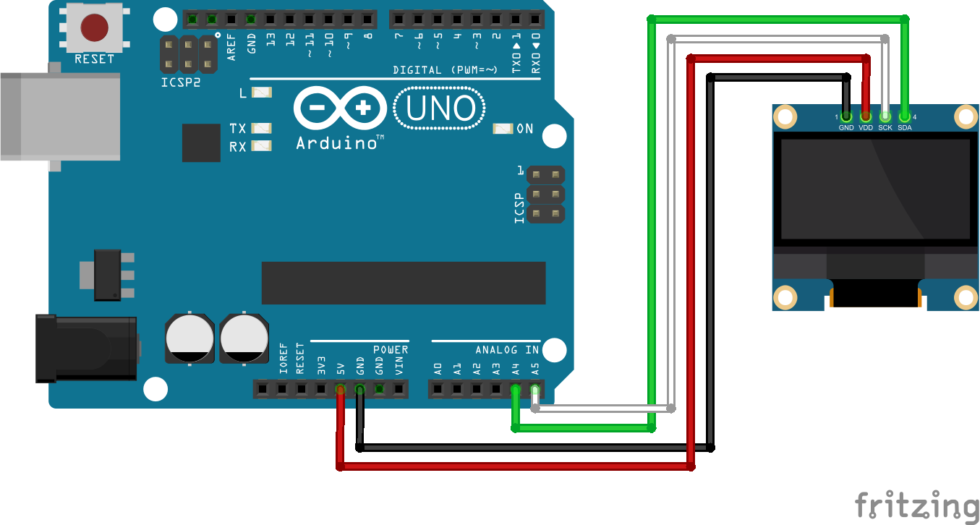

# Displaying Random Questions from Different Categories

## Required Components

### SSD1306 Connection and Set Up

[]()

```cpp
#include <SPI.h>
#include <Wire.h>
#include <Adafruit_GFX.h>
#include <Adafruit_SSD1306.h>

// Declaration for SSD1306 display connected using software I2C (default case):
#define SCREEN_WIDTH 128  
#define SCREEN_HEIGHT 64  
#define OLED_RESET -1     //- if your screen has no reset pin, you have to change that value to -1

Adafruit_SSD1306 display(SCREEN_WIDTH, SCREEN_HEIGHT, &Wire, OLED_RESET);
```